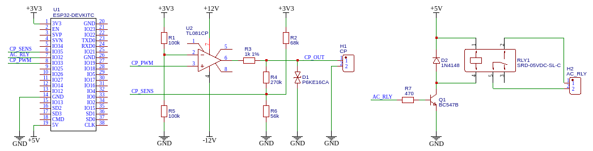
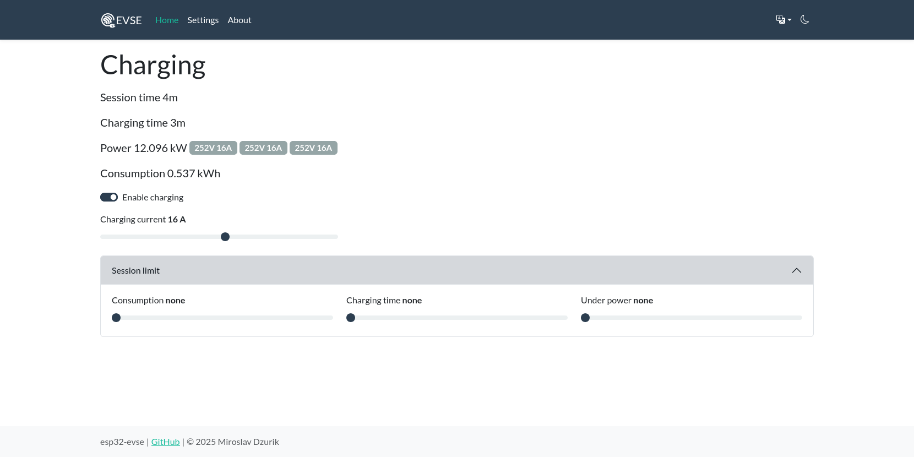
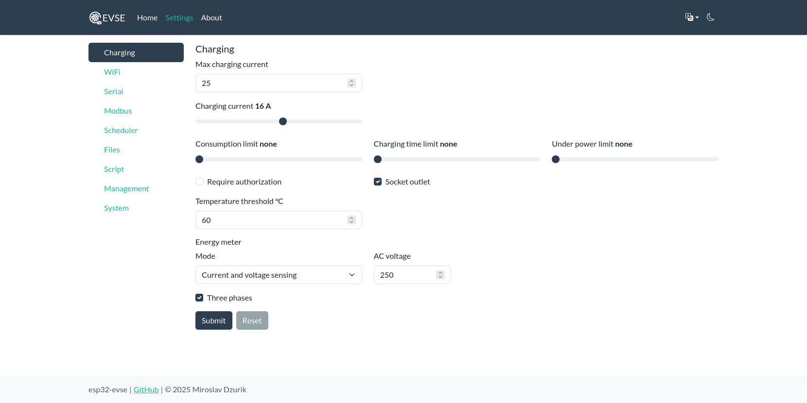
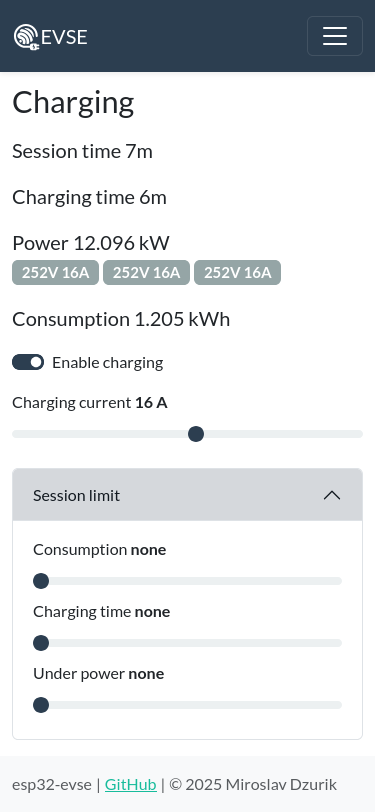

J1772 EVSE firmware for ESP32 based devices.


[](https://github.com/dzurikmiroslav/esp32-evse/releases/latest)
[](20-software/LICENSE.md)
[](https://github.com/sponsors/dzurikmiroslav)
[](installer.md)

## What it does

An **EVSE** (Electric Vehicle Supply Equipment) is the equipment between the AC mains and an electric vehicle &ndash; what most people call the "charger". For AC charging the conversion to DC happens in the vehicle's onboard charger; the EVSE's job is to **supervise and control the supply safely**: confirm a vehicle is properly connected, tell it how much current it may draw, switch the mains on and off through a contactor, and shut down on a fault.

This project is firmware that turns an **ESP32-based board into a fully featured AC EVSE** following the **SAE J1772 / IEC 61851-1** standard. On top of the core charging control it adds the features expected of a modern wallbox &ndash; energy metering, charging limits, access control, a responsive web interface, over-the-air updates, and a range of integration interfaces (REST, [Modbus](20-software/Modbus.md), [Lua scripting](20-software/Lua.md), [Nextion HMI](20-software/Nextion.md), [AT commands](20-software/AT-Commands.md)). See the full list under [Key features](#key-features).

## How it works

The charger and the vehicle communicate over two signalling lines defined by the standard:

- The **[Control Pilot](10-hardware/control-pilot.md)** carries a 1&nbsp;kHz ±12&nbsp;V signal. Its duty cycle tells the vehicle how much current it may draw, and the vehicle answers by changing the voltage to signal that it is connected, ready, or charging.
- The **[Proximity Pilot](10-hardware/proximity-pilot.md)** codes the current rating of a detachable cable, so the charger never offers more current than the cable can carry.

A **[state machine](20-software/state-machine.md)** sits on top of these signals. It reads the Control Pilot, decides when charging is permitted, closes the AC contactor to energize the vehicle, supervises energy metering and protections (residual current, temperature, [socket lock](10-hardware/socket-lock.md)), and returns to a safe state on any fault. Optional [limits and gates](20-software/charging-control.md) &ndash; consumption, time, authorization, tariff enable &ndash; let it match a real installation.

The firmware is written in ESP-IDF and is **not tied to any particular board**: all the hardware details live in a separate configuration file, so the same binary runs on many designs. The [Architecture](20-software/architecture.md) page describes how the pieces fit together, and the [Device definition method](#device-definition-method) below explains the configuration approach.

## Key features
 - Hardware abstraction for device design
 - Responsive web-interface
 - OTA update
 - Integrated energy meter
 - [Modbus](20-software/Modbus.md) (RTU and TCP)
 - [LUA scripting](20-software/Lua.md)
 - [Nextion HMI](20-software/Nextion.md)
 - [AT commands](20-software/AT-Commands.md)
 - REST API
 - WebDAV
 - Scheduler

### Web installer

Easy initial installation of esp32-evse firmware can be performed using a browser.

[Web installer](installer.md)

### Device definition method

_One firmware to rule them all._ Not really :-) one per device platform (ESP32, ESP32-S2...).

There is no need to compile the firmware for your EVSE design.
Source code ist not hardcoded to GPIOs or other hardware design features.
All code is written in ESP-IDF without additional wrapping layer like Arduino.

All configuration is specified separately form the firmware binary in a configuration file named _board.yaml_ stored on a dedicated partition.

For example, the following schematic is a minimal EVSE circuit with ESP32 devkit:



For this circuit _board.yaml_, has to contain only this: 

```yaml
deviceName: ESP32 minimal EVSE

button:
  gpio: 0

pilot:
  gpio: 33
  adcChannel: 7
  levels: [2410, 2104, 1797, 1491, 265]

acRelay:
  gpios: [32]
```

For more information's see [YAML schema](https://github.com/dzurikmiroslav/esp32-evse/tree/master/board-config).

### Web interface

Fully responsive web interface is accessible local network IP address on port 80.

Dashboard page

 

Settings page



Mobile dashboard page



Check out the [build examples page](10-hardware/build-examples.md) to see some hardware in action.

## Donations

ESP32 EVSE firmware is free, but costs money to develop harware and time to develop software.
This gift to the developer would demonstrate your appreciation of this software & hardware and help its future development.

[](https://github.com/sponsors/dzurikmiroslav)
